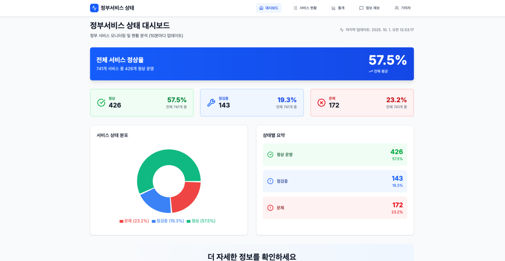

# 정부 사이트 장애 현황 모니터링 시스템

정부 서비스들의 접속 상태를 모니터링하고 분석하는 웹 애플리케이션입니다.  
정부24, 공공서비스 등 주요 사이트의 장애 현황을 **10분마다 자동 업데이트**합니다.  

  

## 🌐 라이브 데모
👉 [정부 사이트 장애 현황 모니터링](https://gov-status.vercel.app)

  

## 🚀 주요 기능
- **실시간 대시보드** : 전체 서비스 정상율, 기관별 현황, 상태 분포 차트  
- **서비스 현황 페이지** : 검색, 필터, 정렬, 그리드/리스트 뷰 제공  
- **분석 페이지** : 기관별 정상율 비교, 시간대별 트렌드, 상세 통계 테이블  
- **정보 제보** : 잘못된 정보·누락 서비스·기술적 문제 제보 시스템  
- **자동 업데이트** : GitHub Actions + MongoDB를 통한 10분 주기 데이터 갱신  
- **SEO 최적화** : sitemap, robots.txt, JSON-LD 구조화 데이터 적용  

  

## 🤝 기여하기

이 프로젝트는 오픈소스로 운영되며, 누구나 기여할 수 있습니다.

1. 저장소 **Fork**
2. **Branch** 생성 (`git checkout -b feature/***`)
3. **Commit** 변경사항 적용 (`git commit -m 'feat: ***'`)
4. 브렌치 **Push**(`git push origin feature/***`)
5. **Pull Request** 생성

프로젝트에 대한 자세한 설명은 [Wiki](https://github.com/ruby-kim/gov-status/wiki)를 참고해주세요.

  

## 📄 라이선스

MIT License - 자세한 내용은 [LICENSE](./LICENSE) 파일을 참조하세요.

  

## 👨‍💻 개발자

**김루비** - govstatus@anb-network.com
